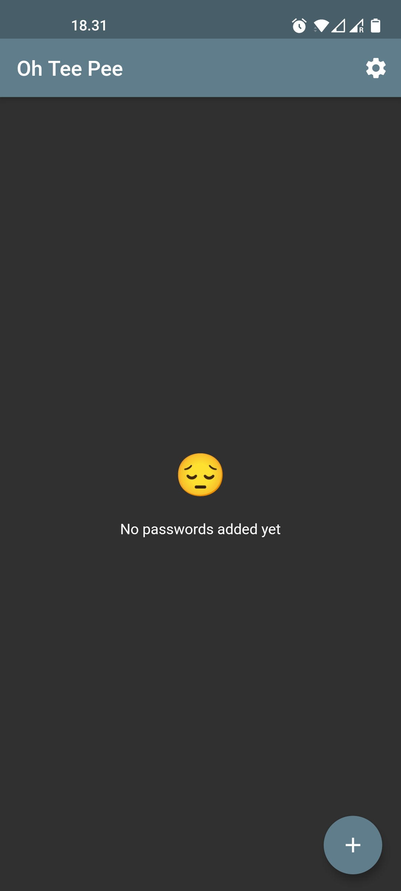
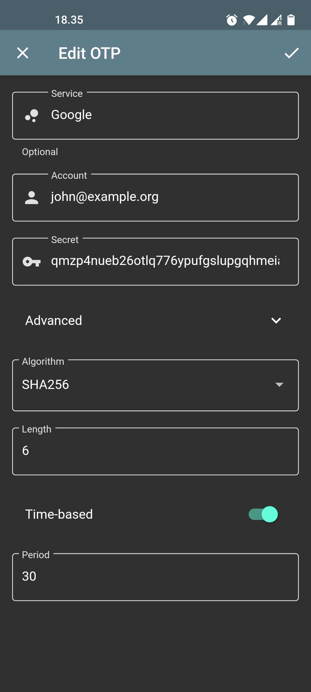

# OhTeePee

A simple OTP (One-Time Password) app for Android and iOS written in Flutter.

# Why?

Why not?

I wrote this app mainly to teach myself Flutter, so it's definitely not a production ready app for storing your one-time passwords. It's built using the Moor library for storage, Redux for state management, and a couple of dart/flutter libraries.

# What can it do?

- 📷 Import OTPs using QR codes
- ✏️ Manually create OTPs using a form
- 🔑 Export OTPs using QR codes

Data is stored in a SQLite database, but secrets are stored using [flutter_secure_storage](https://pub.dev/packages/flutter_secure_storage) (so either Keychain on iOS or using KeyStore on Android).

# What's missing?

The app doesn't have any icon or splash screen, and OTPs don't have customizable icons.

# Isn't Redux, SQLite, Secure Storage, etc. a bit overkill?

You bet it is. Remember this is for educational purposes!

# What does it look like?

Here's how it looks on Android:

<table>
  <tr>
    <td></td>
    <td></td>
    <td></td>
  </tr>
  <tr>
    <td></td>
    <td></td>
  </tr>
</table>

# License

[MIT License](LICENSE)
